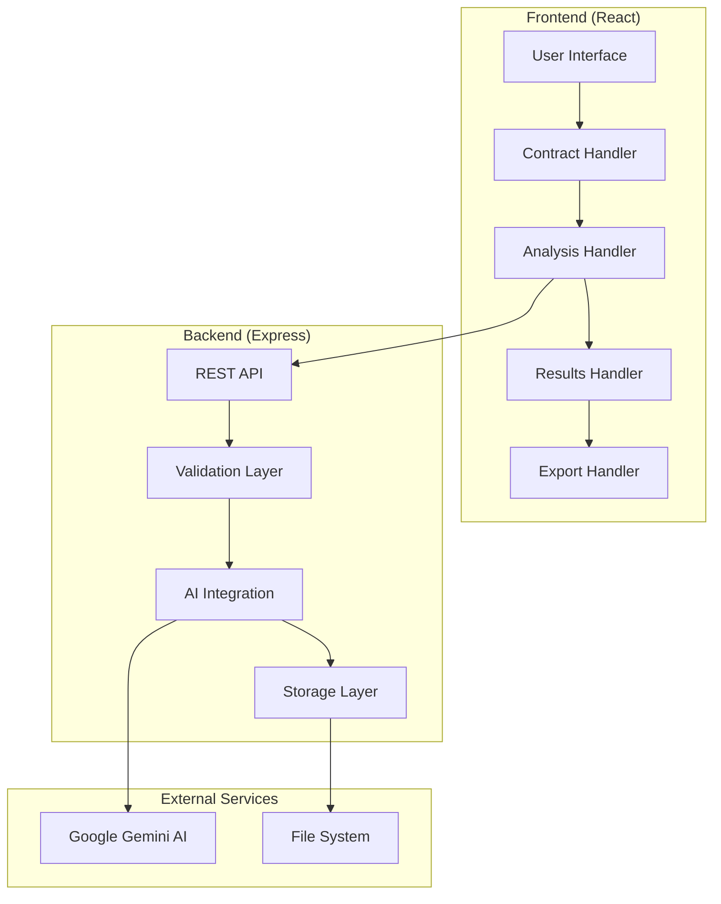

# Техническая архитектура Smart Contract Analyzer

## 🏗️ Обзор системы

Smart Contract Analyzer - это полнофункциональное веб-приложение для анализа юридических договоров с использованием искусственного интеллекта Google Gemini.

## 📊 Диаграмма компонентов



## 🔄 Поток обработки данных

### 1. Загрузка и валидация договора

```typescript
interface ContractUploadFlow {
  // Шаг 1: Пользователь загружает файл
  fileUpload: (file: File) => Promise<string>;
  
  // Шаг 2: Валидация файла
  validateFile: (file: File) => ValidationResult;
  
  // Шаг 3: Извлечение текста
  extractText: (file: File) => Promise<string>;
  
  // Шаг 4: Предварительная обработка
  preprocessText: (text: string) => string;
}

// Реализация валидации
const validateFile = (file: File): ValidationResult => {
  const allowedTypes = ['text/plain', 'application/vnd.openxmlformats-officedocument.wordprocessingml.document'];
  const maxSize = 10 * 1024 * 1024; // 10MB
  
  if (!allowedTypes.includes(file.type)) {
    return { valid: false, error: 'Неподдерживаемый тип файла' };
  }
  
  if (file.size > maxSize) {
    return { valid: false, error: 'Файл слишком большой' };
  }
  
  return { valid: true };
};
```

### 2. Анализ с помощью ИИ

```typescript
interface AnalysisFlow {
  // Построение промпта
  buildPrompt: (params: AnalysisParams) => string;
  
  // Отправка запроса к Gemini
  sendToAI: (prompt: string) => Promise<AIResponse>;
  
  // Парсинг ответа
  parseResponse: (response: AIResponse) => StructuredResult;
  
  // Валидация результата
  validateResult: (result: StructuredResult) => boolean;
}

// Типы анализа
enum AnalysisType {
  CHECKLIST = 'checklist',
  RISK = 'risk', 
  STRUCTURAL = 'structural'
}

interface AnalysisParams {
  contractText: string;
  analysisType: AnalysisType;
  requirements?: string[];
  customPrompt?: string;
}
```

### 3. Обработка результатов

```typescript
interface ResultProcessing {
  // Структурирование данных
  structureResult: (rawResult: any) => AnalysisResult;
  
  // Генерация рекомендаций
  generateRecommendations: (analysis: AnalysisResult) => Recommendation[];
  
  // Расчет метрик
  calculateMetrics: (analysis: AnalysisResult) => Metrics;
  
  // Сохранение в историю
  saveToHistory: (result: AnalysisResult) => Promise<string>;
}

interface AnalysisResult {
  id: string;
  timestamp: Date;
  contractHash: string;
  analysisType: AnalysisType;
  result: ChecklistAnalysis | RiskAnalysis | StructuralAnalysis;
  metrics: Metrics;
  recommendations: Recommendation[];
}
```

## 🧩 Детальная архитектура компонентов

### Frontend Architecture

```
client/
├── src/
│   ├── components/           # Переиспользуемые компоненты
│   │   ├── ui/              # Базовые UI компоненты (shadcn/ui)
│   │   ├── contract-input.tsx    # Загрузка договоров
│   │   ├── analysis-results.tsx  # Отображение результатов
│   │   ├── requirements-input.tsx # Ввод требований
│   │   └── export-controls.tsx   # Экспорт результатов
│   │
│   ├── pages/               # Страницы приложения
│   │   ├── contract-analyzer.tsx # Основная страница анализа
│   │   └── analytics.tsx         # Страница аналитики
│   │
│   ├── hooks/               # React хуки
│   │   ├── use-deepseek-analysis.ts # Хук для работы с ИИ
│   │   ├── use-contract-storage.ts # Хук для локального хранения
│   │   └── use-export.ts          # Хук для экспорта
│   │
│   ├── lib/                 # Утилиты и библиотеки
│   │   ├── gemini.ts        # Интеграция с Gemini AI
│   │   ├── docx-export.ts   # Экспорт в DOCX
│   │   ├── utils.ts         # Общие утилиты
│   │   └── queryClient.ts   # Настройка React Query
│   │
│   └── types/               # TypeScript типы
│       ├── analysis.ts      # Типы для анализа
│       ├── contract.ts      # Типы для договоров
│       └── api.ts           # Типы для API
```

### Backend Architecture

```
server/
├── index.ts                 # Точка входа сервера
├── routes.ts                # API маршруты
├── middleware/              # Express middleware
│   ├── validation.ts        # Валидация запросов
│   ├── error-handler.ts     # Обработка ошибок
│   └── rate-limiter.ts      # Ограничение запросов
├── services/                # Бизнес-логика
│   ├── analysis.service.ts  # Сервис анализа
│   ├── gemini.service.ts    # Сервис работы с ИИ
│   └── storage.service.ts   # Сервис хранения
└── utils/                   # Утилиты сервера
    ├── prompt-builder.ts    # Построение промптов
    ├── response-parser.ts   # Парсинг ответов ИИ
    └── file-handler.ts      # Работа с файлами
```

## 🔐 Система безопасности

### Валидация входных данных

```typescript
// Схемы валидации с использованием Zod
const ContractAnalysisSchema = z.object({
  contractText: z.string()
    .min(100, 'Договор слишком короткий')
    .max(50000, 'Договор слишком длинный'),
  
  requirements: z.array(z.string())
    .min(1, 'Необходимо указать хотя бы одно требование')
    .max(20, 'Слишком много требований'),
  
  analysisType: z.enum(['checklist', 'risk', 'structural'])
});

// Middleware для валидации
const validateAnalysisRequest = (req: Request, res: Response, next: NextFunction) => {
  try {
    ContractAnalysisSchema.parse(req.body);
    next();
  } catch (error) {
    res.status(400).json({ error: 'Неверные данные запроса' });
  }
};
```

### Санитизация данных

```typescript
// Очистка текста договора от потенциально опасного содержимого
const sanitizeContractText = (text: string): string => {
  return text
    .replace(/<script\b[^<]*(?:(?!<\/script>)<[^<]*)*<\/script>/gi, '') // Удаление скриптов
    .replace(/javascript:/gi, '') // Удаление javascript: ссылок
    .replace(/on\w+\s*=/gi, '') // Удаление event handlers
    .trim();
};
```

### Rate Limiting

```typescript
// Ограничение количества запросов
const analysisRateLimit = rateLimit({
  windowMs: 15 * 60 * 1000, // 15 минут
  max: 10, // максимум 10 запросов на анализ за 15 минут
  message: 'Слишком много запросов на анализ. Попробуйте позже.',
  standardHeaders: true,
  legacyHeaders: false,
});
```

## 📈 Мониторинг и логирование

### Система логирования

```typescript
// Структурированное логирование
interface LogEntry {
  timestamp: Date;
  level: 'info' | 'warn' | 'error';
  service: string;
  action: string;
  userId?: string;
  metadata?: Record<string, any>;
}

const logger = {
  info: (action: string, metadata?: Record<string, any>) => {
    console.log(JSON.stringify({
      timestamp: new Date(),
      level: 'info',
      service: 'contract-analyzer',
      action,
      metadata
    }));
  },
  
  error: (action: string, error: Error, metadata?: Record<string, any>) => {
    console.error(JSON.stringify({
      timestamp: new Date(),
      level: 'error',
      service: 'contract-analyzer',
      action,
      error: error.message,
      stack: error.stack,
      metadata
    }));
  }
};
```

### Метрики производительности

```typescript
// Отслеживание времени выполнения анализа
const performanceTracker = {
  startAnalysis: (analysisId: string) => {
    performance.mark(`analysis-start-${analysisId}`);
  },
  
  endAnalysis: (analysisId: string) => {
    performance.mark(`analysis-end-${analysisId}`);
    performance.measure(
      `analysis-duration-${analysisId}`,
      `analysis-start-${analysisId}`,
      `analysis-end-${analysisId}`
    );
    
    const measure = performance.getEntriesByName(`analysis-duration-${analysisId}`)[0];
    logger.info('analysis-completed', {
      analysisId,
      duration: measure.duration,
      timestamp: new Date()
    });
  }
};
```

## 🚀 Оптимизация производительности

### Кэширование

```typescript
// Многоуровневое кэширование
class AnalysisCache {
  private memoryCache = new Map<string, CacheEntry>();
  private readonly TTL = 60 * 60 * 1000; // 1 час
  
  async get(key: string): Promise<AnalysisResult | null> {
    // Проверка memory cache
    const memoryEntry = this.memoryCache.get(key);
    if (memoryEntry && !this.isExpired(memoryEntry)) {
      return memoryEntry.data;
    }
    
    // Проверка file cache
    const fileEntry = await this.getFromFileCache(key);
    if (fileEntry) {
      // Восстановление в memory cache
      this.memoryCache.set(key, {
        data: fileEntry,
        timestamp: Date.now()
      });
      return fileEntry;
    }
    
    return null;
  }
  
  async set(key: string, data: AnalysisResult): Promise<void> {
    // Сохранение в memory cache
    this.memoryCache.set(key, {
      data,
      timestamp: Date.now()
    });
    
    // Сохранение в file cache
    await this.saveToFileCache(key, data);
  }
  
  private isExpired(entry: CacheEntry): boolean {
    return Date.now() - entry.timestamp > this.TTL;
  }
}
```

### Оптимизация промптов

```typescript
// Адаптивные промпты в зависимости от размера договора
const getOptimizedPrompt = (contractText: string, analysisType: AnalysisType): string => {
  const textLength = contractText.length;
  
  if (textLength < 5000) {
    // Детальный анализ для коротких договоров
    return DETAILED_PROMPTS[analysisType];
  } else if (textLength < 20000) {
    // Стандартный анализ
    return STANDARD_PROMPTS[analysisType];
  } else {
    // Сокращенный анализ для длинных договоров
    return CONCISE_PROMPTS[analysisType];
  }
};
```

## 🔄 CI/CD и развертывание

### GitHub Actions Workflow

```yaml
# .github/workflows/deploy.yml
name: Deploy to Production

on:
  push:
    branches: [main]

jobs:
  test:
    runs-on: ubuntu-latest
    steps:
      - uses: actions/checkout@v3
      - uses: actions/setup-node@v3
        with:
          node-version: '18'
      - run: npm ci
      - run: npm run test
      - run: npm run build

  deploy:
    needs: test
    runs-on: ubuntu-latest
    steps:
      - name: Deploy to server
        run: |
          # Команды развертывания
```

### Docker Configuration

```dockerfile
# Dockerfile
FROM node:18-alpine

WORKDIR /app

# Копирование package files
COPY package*.json ./
RUN npm ci --only=production

# Копирование исходного кода
COPY . .

# Сборка приложения
RUN npm run build

# Экспорт порта
EXPOSE 5000

# Запуск приложения
CMD ["npm", "start"]
```

## 📊 Мониторинг в продакшене

### Health Checks

```typescript
// Проверка состояния системы
app.get('/health', async (req, res) => {
  const health = {
    status: 'ok',
    timestamp: new Date(),
    services: {
      gemini: await checkGeminiAPI(),
      storage: await checkStorage(),
      memory: process.memoryUsage(),
      uptime: process.uptime()
    }
  };
  
  res.json(health);
});
```

### Алерты и уведомления

```typescript
// Система уведомлений о критических ошибках
const alerting = {
  sendAlert: async (level: 'warning' | 'critical', message: string, metadata?: any) => {
    if (level === 'critical') {
      // Отправка в Slack/Discord/Email
      await notificationService.send({
        channel: '#alerts',
        message: `🚨 CRITICAL: ${message}`,
        metadata
      });
    }
  }
};
```

Эта архитектура обеспечивает:
- **Масштабируемость** - модульная структура позволяет легко добавлять новые функции
- **Надежность** - многоуровневая обработка ошибок и валидация
- **Производительность** - кэширование и оптимизация запросов
- **Безопасность** - валидация, санитизация и rate limiting
- **Мониторинг** - подробное логирование и метрики
